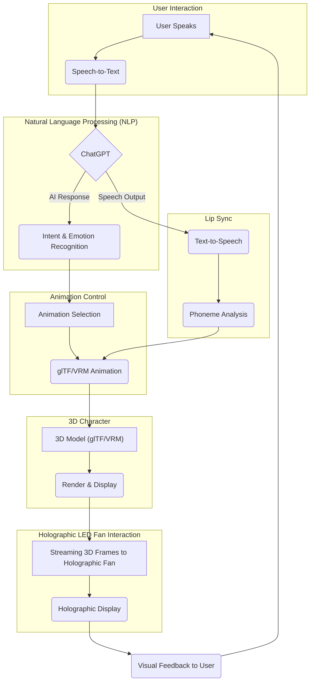

# **Building an Interactive 3D Chatbot with Real-Time Holographic LED Fan Integration: Step-by-Step Guide**

This tutorial demonstrates how to create an **interactive 3D chatbot** with real-time animations, powered by **ChatGPT** and displayed on **Missyou** or **GIWOX holographic LED fans**. We integrate a 3D model, customize animations, and synchronize lip sync with chatbot responses.

## Introduction
Interactive 3D chatbots combined with **LED holographic fans** bring a futuristic dimension to human-computer interaction. This tutorial extends the concept by integrating **ChatGPT** with **3D holographic fans** (Missyou and GIWOX), enabling real-time conversation and animated chatbot displays in 3D.

This project combines several Python packages to create an interactive 3D chatbot, integrating ChatGPT for conversational responses, real-time animations for a 3D model, and holographic LED fan technology for display. Each package contributes to a specific aspect of the pipeline, ensuring smooth interaction between the chatbot, 3D character, and holographic display.

## Example of prototype
 

From [3D holographic fan-Cindy](https://www.youtube.com/@3dholographicfan-cindy978)

Below is a table summarizing the primary Python packages used in this project, their roles, and how they enable the chatbot and holographic integration.

---

### **Overview Table**

| **Package**       | **Description**                   | **File Types**       | **ChatGPT Integration**                                 | **3D Chatbot + LED Fan**                                 | **3D Chatbot AI Integration**                                                                                   |
|--------------------|-----------------------------------|-----------------------|---------------------------------------------------------|----------------------------------------------------------|-----------------------------------------------------------------------------------------------------------------|
| `matplotlib`      | A versatile plotting library for generating simple 3D animations. | Rendered Frames (PNG) | - Display chatbot responses as text or gestures in 3D   | - Real-time gesture animations for chatbot display       | - **3D Chatbot:** Create dynamic animations tied to ChatGPT responses.                                          |
| `openai`          | OpenAI's library for accessing ChatGPT and GPT models. | Text                  | - Generate intelligent chatbot responses                | - Drive animations and lip sync based on chatbot text    | - **AI-driven expressions:** Determine animations and expressions based on conversation context.                 |
| `Pillow`          | Python Imaging Library for image processing and format conversion. | PNG                   | - Enhance or modify chatbot-generated frames            | - Convert animations to fan-compatible formats           | - **Lip sync simulation:** Adjust animations to match speech phonemes dynamically.                              |
| `requests`        | A library for sending HTTP requests to APIs. | API (HTTP)            | - Automate chatbot-to-fan communication                 | - Stream chatbot animations and text to holographic fans | - **Seamless streaming:** Enable real-time frame uploads to holographic displays.                               |
| `pygame`          | A library for real-time graphics and game development. | Real-time Display     | - Simulate animations locally for debugging             | - Preview holographic animations before streaming        | - **Real-time rendering:** Test animations in a graphical window before finalizing for LED fans.                |
| `pygltflib`       | A library for working with glTF/GLB 3D model files. | glTF/GLB              | - Customize 3D character animations via API             | - Render and animate chatbot character models            | - **3D model integration:** Adjust animations and blend shapes based on chatbot emotions and phoneme analysis.  |
| `gtts`            | Google Text-to-Speech for speech synthesis. | MP3                   | - Convert chatbot responses into speech audio           | - Synchronize audio with 3D lip animations               | - **Text-to-Speech:** Generate spoken responses tied to chatbot text output.                                    |

---

### **How These Packages Work Together**
- **Core AI Integration**:
  - `openai` generates intelligent chatbot responses based on user input, serving as the brain of the chatbot.
  
- **3D Visualization and Animation**:
  - `matplotlib` dynamically renders 3D animations representing the chatbot's response, while `pygltflib` manages detailed 3D character animations.
  - `pygame` serves as a testing environment for previewing animations before sending them to the holographic fan.

- **Image Processing and Holographic Streaming**:
  - `Pillow` processes the generated frames, ensuring compatibility with the holographic LED fan's display requirements.
  - `requests` streams the processed frames to the LED fan's API for real-time visualization.

- **Audio and Lip Sync**:
  - `gtts` synthesizes speech for chatbot responses, while `pygltflib` adjusts the character's mouth animations to match the audio using phoneme analysis.
---

## **Pipeline Overview**



---

## **Table of Contents**

1. [Setting Up the Environment](#setting-up-the-environment)
2. [Loading and Customizing a 3D Model](#loading-and-customizing-a-3d-model)
3. [Integrating ChatGPT with the 3D Model](#integrating-chatgpt-with-the-3d-model)
4. [Adding Lip Sync and Animations](#adding-lip-sync-and-animations)
5. [Streaming Real-Time 3D Frames to the LED Fan](#streaming-real-time-3d-frames-to-the-led-fan)
6. [Full Python Code](#full-python-code)
7. [Testing and Debugging](#testing-and-debugging)

---

## **1. Setting Up the Environment**

### Install Required Libraries

```bash
pip install openai pygltflib pillow requests pygame gtts
```

- **`openai`:** For ChatGPT API integration.
- **`pygltflib`:** To load and modify 3D models (glTF/VRM).
- **`Pillow`:** For frame image processing.
- **`requests`:** For sending frames to the LED fan API.
- **`pygame`:** For rendering animations locally.
- **`gtts`:** For generating speech from chatbot responses.

---

## **2. Loading and Customizing a 3D Model**

### Choose a 3D Model
Select a glTF/GLB or VRM model for your chatbot. Use platforms like:
- [**Sketchfab**](https://www.sketchfab.com/)
- [**Mixamo**](https://www.mixamo.com/)

### Python Code: Load and Customize the Model
Load the model using `pygltflib` and apply custom animations.

```python
import pygltflib

# Load a 3D model (glTF format)
model = pygltflib.GLTF2()
model.load_file("character_model.glb")

# Apply a simple customization (e.g., scaling the character)
def customize_model():
    for node in model.nodes:
        if node.name == "Head":  # Customize the head node
            node.scale = [1.2, 1.2, 1.2]  # Scale the head
    model.save("customized_character.glb")
    
customize_model()
```

---

## **3. Integrating ChatGPT with the 3D Model**

### Obtain ChatGPT Responses
Integrate ChatGPT for conversational responses.

```python
import openai

openai.api_key = "your-api-key"

def get_chat_response(user_input):
    """
    Get a response from ChatGPT.
    """
    response = openai.Completion.create(
        engine="text-davinci-003",
        prompt=user_input,
        max_tokens=150,
        temperature=0.7
    )
    return response.choices[0].text.strip()
```

---

## **4. Adding Lip Sync and Animations**

### Generate Speech and Analyze Phonemes
Use `gTTS` for speech generation and basic phoneme analysis.

```python
from gtts import gTTS
import os

def generate_speech(text):
    """
    Generate speech from text using gTTS.
    """
    tts = gTTS(text)
    tts.save("response.mp3")
    os.system("mpg123 response.mp3")
```

### Apply Lip Sync to the 3D Model
Map phonemes to blend shapes in the glTF/VRM model.

```python
def apply_lip_sync(phoneme):
    for node in model.nodes:
        if node.name == "Mouth":
            if phoneme == "A":
                node.scale = [1.1, 1.1, 1.1]
            elif phoneme == "O":
                node.scale = [1.3, 1.3, 1.3]
    model.save("lip_synced_character.glb")
```


## **4.1 Fan Integration Setup** 

### Configuring Holographic LED Fans

To successfully display animations on holographic LED fans like **Missyou** or **GIWOX**, you need to set up the fan's API or SDK. Follow these steps to ensure smooth integration:

1. **Check Fan API Documentation**: Refer to the official documentation for your fan model to identify supported file formats, resolutions, and API endpoints. Commonly supported formats include:
   - **PNG** for individual frames.
   - **MP4** for video animations.

2. **Network Configuration**:
   - Ensure the fan is connected to the same local network as your computer.
   - Obtain the IP address of the fan (often displayed in the fan's mobile app or web interface).

3. **Verify Fan API**:
   Test the API connection by uploading a static image.

```bash
# Example cURL command to test fan API connectivity
curl -X POST -F "file=@example.png" http://<fan-ip-address>/upload_frame
```

### Sample Python Code: Upload a Test Frame

```python
import requests

FAN_API_URL = "http://<fan-ip-address>/upload_frame"

def test_fan_api(image_path):
    """
    Upload a test frame to the holographic fan.
    """
    with open(image_path, 'rb') as img:
        response = requests.post(FAN_API_URL, files={'frame': img})
    if response.status_code == 200:
        print("Test frame uploaded successfully!")
    else:
        print(f"Failed to upload frame. Status code: {response.status_code}")

test_fan_api("example.png")
```

---

## **4.2 Frame Conversion for Fan Compatibility** 

### Converting Animations to Compatible Formats

Holographic LED fans may require frames or animations in a specific resolution and format. You can use `ffmpeg` to prepare frames for compatibility.

#### Install `ffmpeg`

```bash
sudo apt update
sudo apt install ffmpeg
```

#### Convert PNG Frames to MP4 Animation

```bash
# Convert a series of PNG frames into an MP4 video
ffmpeg -r 30 -i frame_%03d.png -vf "scale=256:256" -vcodec libx264 animation.mp4
```

#### Python Code: Save Compatible Frames

```python
from PIL import Image

def convert_to_fan_format(input_image_path, output_image_path, size=(256, 256)):
    """
    Convert an image to the fan's required resolution and format.
    """
    with Image.open(input_image_path) as img:
        img = img.resize(size, Image.ANTIALIAS)
        img.save(output_image_path, format="PNG")

convert_to_fan_format("original_frame.png", "fan_ready_frame.png")
```

---

## **4.3 Phoneme Extraction for Lip Sync** 

### Extracting Phonemes for Lip Sync

To map chatbot responses to lip movements, extract phonemes from text or audio. Use the `phonemizer` library for text-to-phoneme conversion.

#### Install `phonemizer`

```bash
pip install phonemizer
```

#### Python Code: Text-to-Phoneme Conversion

```python
from phonemizer import phonemize

def extract_phonemes(text, language='en-us'):
    """
    Convert text to phonemes using the phonemizer library.
    """
    phonemes = phonemize(text, language=language, backend='espeak', strip=True)
    return phonemes

# Example usage
text = "Hello, how are you?"
phonemes = extract_phonemes(text)
print(f"Phonemes: {phonemes}")
```

#### Map Phonemes to 3D Mouth Movements

Extend the `apply_lip_sync` function:

```python
def apply_lip_sync(phoneme):
    """
    Adjust mouth animations based on phoneme.
    """
    for node in model.nodes:
        if node.name == "Mouth":
            if phoneme in ["A", "E"]:
                node.scale = [1.1, 1.1, 1.1]
            elif phoneme in ["O", "U"]:
                node.scale = [1.3, 1.3, 1.3]
    model.save("lip_synced_character.glb")
```

---

## **5. Streaming Real-Time 3D Frames to the LED Fan**

### Generate 3D Frames
Render the 3D chatbot animation dynamically.

```python
import numpy as np
import matplotlib.pyplot as plt
from PIL import Image
import io

# Initialize 3D plot
fig = plt.figure(figsize=(5, 5))
ax = fig.add_subplot(111, projection='3d')

def generate_frame(text, angle):
    """
    Generate a 3D frame displaying rotating chatbot text.
    """
    ax.clear()
    ax.text(0, 0, 0, text, color="blue", fontsize=15, ha="center", va="center")
    ax.set_xlim([-1, 1])
    ax.set_ylim([-1, 1])
    ax.set_zlim([-1, 1])
    ax.view_init(elev=20, azim=angle)
    
    fig.canvas.draw()
    frame = np.frombuffer(fig.canvas.tostring_rgb(), dtype=np.uint8)
    frame = frame.reshape(fig.canvas.get_width_height()[::-1] + (3,))
    return frame
```

### Stream Frames to the Fan
Send frames to the holographic fan in real time.

```python
import requests
import time

FAN_API_URL = "http://<fan-ip-address>/upload_frame"

def send_frame_to_fan(frame):
    """
    Send a single frame to the LED fan.
    """
    buffer = io.BytesIO()
    image = Image.fromarray(frame)
    image.save(buffer, format="PNG")
    buffer.seek(0)

    response = requests.post(FAN_API_URL, files={'frame': buffer})
    return response.status_code
```

## **5.1 Error Handling for Streaming and API Integration** 

### Handle API Errors

Add robust error handling for fan API failures:

```python
import requests

def send_frame_to_fan(frame):
    """
    Send a frame to the fan and handle potential errors.
    """
    try:
        buffer = io.BytesIO()
        image = Image.fromarray(frame)
        image.save(buffer, format="PNG")
        buffer.seek(0)

        response = requests.post(FAN_API_URL, files={'frame': buffer})
        response.raise_for_status()
        print("Frame sent successfully!")
    except requests.exceptions.RequestException as e:
        print(f"Error sending frame to fan: {e}")
```

---

## **5.2 Real-Time Synchronization**

### Using Asynchronous Programming for Sync

Real-time synchronization between animations, audio, and responses can be achieved using `asyncio`.

#### Python Code: Synchronize Audio and Animation

```python
import asyncio
from gtts import gTTS
import os

async def play_audio_and_animate(text, animation_func):
    """
    Play audio and animate simultaneously.
    """
    # Generate speech
    tts = gTTS(text)
    tts.save("response.mp3")

    # Play audio in the background
    audio_task = asyncio.create_task(asyncio.to_thread(os.system, "mpg123 response.mp3"))

    # Animate
    animation_task = asyncio.create_task(animation_func())

    await asyncio.gather(audio_task, animation_task)
```


---

## **6. Full Python Code**

Here is the complete integrated script:

```python
import numpy as np
import matplotlib.pyplot as plt
from PIL import Image
import io
import requests
import openai
from gtts import gTTS
import time

# ChatGPT API key
openai.api_key = "your-api-key"

# Initialize 3D plot
fig = plt.figure(figsize=(5, 5))
ax = fig.add_subplot(111, projection='3d')

# Fan API endpoint
FAN_API_URL = "http://<fan-ip-address>/upload_frame"

# Generate a 3D frame
def generate_frame(text, angle):
    ax.clear()
    ax.text(0, 0, 0, text, color="blue", fontsize=15, ha="center", va="center")
    ax.set_xlim([-1, 1])
    ax.set_ylim([-1, 1])
    ax.set_zlim([-1, 1])
    ax.view_init(elev=20, azim=angle)
    
    fig.canvas.draw()
    frame = np.frombuffer(fig.canvas.tostring_rgb(), dtype=np.uint8)
    frame = frame.reshape(fig.canvas.get_width_height()[::-1] + (3,))
    return frame

# Get ChatGPT response
def get_chat_response(user_input):
    response = openai.Completion.create(
        engine="text-davinci-003",
        prompt=user_input,
        max_tokens=150,
        temperature=0.7
    )
    return response.choices[0].text.strip()

# Generate speech
def generate_speech(text):
    tts = gTTS(text)
    tts.save("response.mp3")
    os.system("mpg123 response.mp3")

# Stream frames to the fan
def send_frame_to_fan(frame):
    buffer = io.BytesIO()
    image = Image.fromarray(frame)
    image.save(buffer, format="PNG")
    buffer.seek(0)

    response = requests.post(FAN_API_URL, files={'frame': buffer})
    return response.status_code

# Main loop
angle = 0
try:
    while True:
        user_input = input("You: ")
        chatbot_response = get_chat_response(user_input)
        generate_speech(chatbot_response)
        
        for _ in range(60):  # Display for 2 seconds
            frame = generate_frame(chatbot_response, angle)
            send_frame_to_fan(frame)
            angle += 6
            time.sleep(0.033)
except KeyboardInterrupt:
    print("Streaming stopped.")
```

---

## **7. Testing and Debugging**

1. **Fan Connectivity**:
   - Test the fan's API using a static image upload.
2. **Streaming Performance**:
   - Optimize frame resolution and transmission speed for smooth animations.
3. **Chatbot Responses**:
   - Validate ChatGPT's responses and ensure they match user input.


## **7.1 Testing Checklist** 

### Step-by-Step Testing

1. **Test ChatGPT Integration**:
   - Verify responses with varying prompts.
   - Ensure the API key is configured correctly.

```python
print(get_chat_response("What is the capital of France?"))
```

2. **Test 3D Animation Locally**:
   - Render animations using `pygame` or `matplotlib`.
   - Check for frame generation errors.

3. **Test Fan Connectivity**:
   - Upload static images to the fan's API.
   - Verify frame display on the fan.

4. **Test Full Pipeline**:
   - Combine ChatGPT, 3D animations, and fan streaming.
   - Ensure synchronization between audio and animations.

---

## **Conclusion**

This comprehensive tutorial shows how to integrate a 3D chatbot with real-time animations and display it on a holographic LED fan. The interactive pipeline connects ChatGPT responses to 3D animations, creating a dynamic and engaging user experience.
### Scaling for Complex Animations

For more complex animations or multiple fans:
- Use threading or multiprocessing for parallel frame generation.
- Integrate advanced rendering engines like Unity or Unreal Engine.


### Customizing the Chatbot

To change the character's voice or appearance:
- Use platforms like [ElevenLabs](https://www.elevenlabs.io/) for voice cloning.
- Modify the glTF/GLB model using Blender or Mixamo for unique animations.